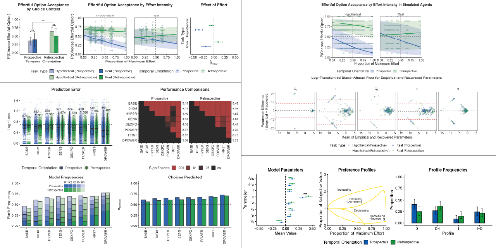

# Analyze and model effort-based choice in economic decision-making

This repository contains the data and analysis scripts for the peer-reviewed paper "Effort can have positive, negative, and non-monotonic impacts on outcome value in economic choice" by Przemysław Marcowski, Wojciech Białaszek, and Piotr Winkielman.

Visit the project on the Open Science Framework (OSF) [here](https://osf.io/e3baz/).

## Table of Contents

- [Overview](#overview)
- [Directory Structure](#directory-structure)
- [Installation](#installation)
- [Usage](#usage)
- [Data](#data)
- [Analysis](#analysis)
- [Models](#models)
- [Parameters](#parameters)
- [License](#license)
- [Citation](#citation)
- [Contact](#contact)

## Overview

This project investigates the relationship between effort and perceived value in decision-making processes. While effort is an inherent part of almost every action, its impact on decision-making is not straightforward. Previous research has shown that effort can either devalue or enhance outcomes, depending on the context. Our study aims to bridge this gap by proposing a comprehensive model that accounts for these diverse effects of effort on outcome valuation.

The research uses both empirical and modeling approaches to demonstrate that effort can decrease, increase, or have non-monotonic effects on the perceived value of effort-contingent outcomes. We designed an experiment where participants made choices between monetary rewards and items associated with varying levels of physical effort (stair climbing). The study manipulated two key factors:

1. Temporal orientation: Whether decisions were made prospectively (before effort exertion) or retrospectively (after effort exertion).
2. Task type: Whether the effort and rewards were purely hypothetical or actually experienced by the participants.

Our key findings include:

1. The effects of effort on valuation depend on the timing of effort and the tangibility of effort and rewards.
2. In "real" conditions (with experienced effort and tangible rewards), greater effort decreased outcome value when considered prospectively but increased outcome value when considered retrospectively.
3. These opposing effects of effort on valuation were particularly pronounced in contexts involving tangible, real effort and rewards.
4. Individual responses to effort varied considerably, with some people showing a monotonic positive relationship between effort and value, others showing an inverse relation, and some displaying shifting preferences.

To capture these diverse patterns, we developed a novel computational model called DPOWER (Dual-system Power Model). This model outperformed previous solutions in explaining individual decisions, primarily due to its ability to account for the heterogeneity in individual responses to effort.

The project includes scripts for data preprocessing, statistical analysis using both selected nonlinear models and Generalized Linear Mixed Models (GLMM), model fitting, and visualization of results. By providing a more nuanced understanding of how effort influences our choices, this research has implications for various fields where effort is a key variable in decision-making processes.

## Directory Structure

```
effort-choice-models/
│
├── R/
│   ├── helpers.R
│   ├── models.R
│   ├── validate.R
│   └── colors.R
│
├── data/
│   ├── base/
│   └── processed/
│
├── output/
│   ├── models/
│   │   ├── base/
│   │   ├── processed/
│   │   ├── starts/
│   │   └── boot/
│   └── plots/
│
├── preprocess_data.R
├── glmm_analysis.R
├── model_visualization.R
├── model_validation.R
├── model_inference.R
├── model_recovery.R
├── task_validation.R
├── LICENSE
└── README.md
```

Summary of the directory structure:

`R/`: Contains helper functions, model definitions, validation tools, and color schemes used across the project.


`data/`: Stores experimental data.

&nbsp;&nbsp;&nbsp;`base/`: Contains raw, unprocessed experimental data.

&nbsp;&nbsp;&nbsp;`processed/`: Holds cleaned and preprocessed data ready for analysis.


`output/`: Houses the results of model fitting, analysis, and visualizations.

&nbsp;&nbsp;&nbsp;`models/:` Includes raw and processed model outputs, initial parameter values, and bootstrap analysis results.

&nbsp;&nbsp;&nbsp;`plots/`: Contains generated figures and visualizations.


`*.R`: R scripts for data preprocessing, GLMM analysis, model cross-validation, model inference, model recovery, and behavioral task validation, located in the root directory.

## Installation

No installation is required beyond having R and the necessary libraries. To run the script, simply clone this repository or download the script files and execute them within your R environment. Refer to the header of each script for a complete list of necessary libraries for that specific analysis.

## Usage

1. Clone this repository:
   ```
   git clone [https://github.com/pmarcowski/effort-value-study.git](https://github.com/pmarcowski/effort-value-study.git)
   ```
2. Navigate to the project directory:
   ```
   cd effort-value-study
   ```
3. Run the R scripts in the root directory in the following order:
   - `preprocess_data.R`
   - `glmm_analysis.R`
   - `model_visualization.R`
   - `model_validation.R`
   - `model_inference.R`
   - `model_recovery.R`

In addition, the `task_validation.R` script performs analysis of the demand characteristics of our experimental task.

Each script can be executed in an R environment. The scripts are designed to be run sequentially, as later scripts may depend on the output of earlier ones.

## Data

The experiment used a mixed design with repeated measures:
- 2 (temporal orientation: prospective or retrospective; between-subjects) 
- 2 (task type: hypothetical or real; within-subjects) 
- 5 (effort intensity: [45, 75, 115, 175, 270] stairs; within-subjects)

Participants made choices between an effortless monetary payoff or an item (mug) associated with a given level of effort. The effort was presented as climbing a given number of stairs.

The `data/` directory contains both base and processed data. The `task_test.csv` file contains behavioral task demand analysis data. The `performance.csv` file contains effort performance data for each participant. Processed data will be saved in the `data/processed/` directory after running the preprocessing script.

## Analysis

The analysis is split into several steps:

1. Data preprocessing (`preprocess_data.R`)
2. GLMM analysis of behavioral data (`glmm_analysis.R`)
3. Visualization of example value functions under DPOWER model (`model_visualization.R`)
4. Cross-validation of nonlinear choice models (`model_validation.R`)
5. Inference on choice models (`model_inference.R`)
6. Recovery analysis of choice models (`model_recovery.R`)

Results and plots will be saved in the relevant subdirectory of the `output/` directory. Please note: modeling procedure, particularly cross-validation, require relatively large computational power; bootstrapping analysis will generate a few Gb of data.

## Models

The study compares several models of effort-based choice (defined in `models.R`):

1. BASE (Baseline Intercept Model)
2. SIGM (Sigmoidal Model)
3. HYPER (Hyperboloid Model)
4. SENS (Constant Sensitivity Model)
5. DEXPO (Double Exponential Model)
6. POWER (Flexible Power Function)
7. HRST (Heuristic Choice Model)
8. DPOWER (Dual-system Power Model) - our novel model

The DPOWER model is defined as:
$$sv(x) = x * [1 - \omega\delta_{1}E^{\gamma_{1}} + (1 - \omega)\delta_{2}E^{\gamma_{2}}]$$

Where:

- $sv(x)$ is the subjective value assigned to an effortful outcome
- $x$ is the nominal value of the outcome
- $E$ is the effort
- $\delta_{1}$ and $\delta_{2}$ control the slope of the value function
- $\gamma_{1}$ and $\gamma_{2}$ individually scale the subsystems
- $\omega$ determines the weight assigned to each subsystem (0 < $\omega$ < 1)

## License

This project is licensed under the MIT License - see the [LICENSE](LICENSE) file for details.

## Citation

If you use this code or data in your research, please cite our paper:

[citation information to be added upon publication]

## Contact

For any questions or feedback, please contact the author directly.
